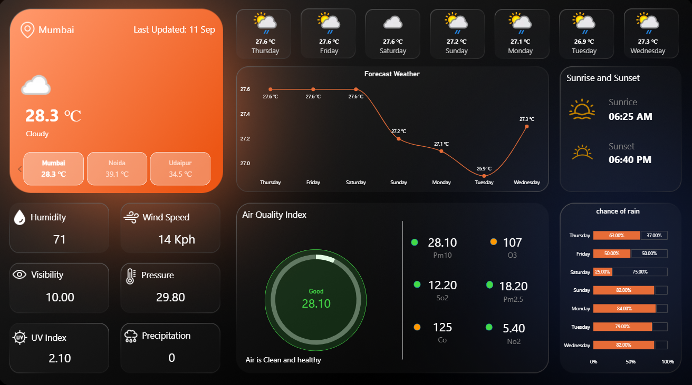

# 🌦️ Weather Dashboard – Power BI

An interactive weather analytics dashboard built using Microsoft Power BI to monitor current weather conditions, forecasts, precipitation, air quality, and location-based weather insights.

## 📊 Dashboard Overview

The dashboard provides:

- 🌡️ Current Temperature
- 💧 Humidity
- 💨 Wind Speed
- 🌧️ Precipitation
- ☁️ Weather Conditions
- 🌦️ 7-Day Weather Forecast
- 🌧️ Chance of Rain
- 🫁 Air Quality
- 📍 Location-based Weather Analysis

## 🛠️ Tools & Technologies

- Microsoft Power BI
- Power Query
- DAX
- Data Transformation
- Data Visualization
- Weather API Data

## 📈 Key Features

### Current Weather
Displays real-time/current weather information for the selected location.

### Weather Forecast
Provides a day-wise forecast including temperature and chance of rain.

### Air Quality
Tracks major air-quality indicators such as:

- PM2.5
- PM10
- CO
- NO₂
- SO₂
- O₃

### Interactive Filters
Users can select a location and explore weather information dynamically.

## 📷 Dashboard Preview

## 📁 Project Files
- `Dataset`-Current data ,Forecast_day data, Dorecast_hour data
- `Weather_Dashboard.pbix` – Power BI dashboard file
- `Dashboard_Screenshot.png` – Dashboard preview
- `README.md` – Project documentation

## 🎯 Skills Demonstrated

- Data Cleaning & Transformation
- Power Query
- DAX Measures
- Data Modeling
- KPI Design
- Interactive Dashboard Development
- Data Visualization
- Weather Data Analysis
